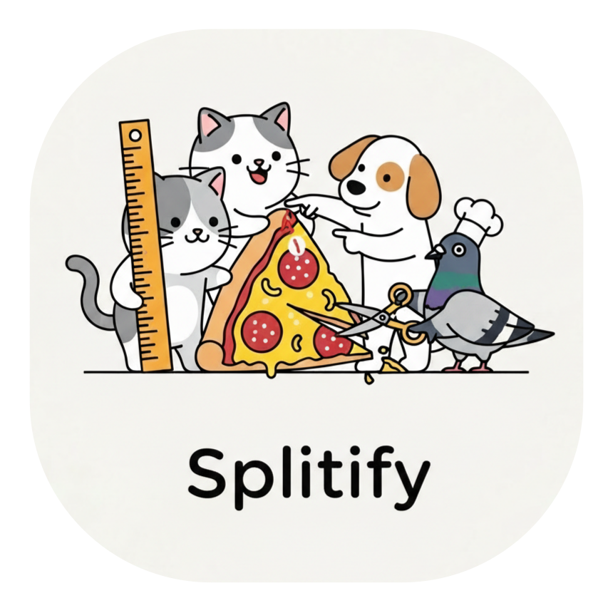

<p align="center">
  
</p>

# Splitify

**Turn your "WIP" chaos into distinct, atomic commits.**

AI coding tools are a double-edged sword. You spend two hours in a flow state with GitHub Copilot, and suddenly you have touched 40 files across three different architectural layers. You have a new feature, a refactor, a bug fix, and a typo correction all sitting in your working tree.

Usually, you’d sigh, `git add .`, and commit it all as *"updates"* (we know you do it).

**Splitify** is the intervention you need. It analyzes your uncommitted mess using GitHub Copilot directly from VS Code, logically groups files by intent, and generates commit messages that match your project's style. It makes you look organized, even if you aren't.

## Features

### Analyze & Group Changes

Run **Splitify: Analyze & Group Changes** from the Command Palette. We send your diffs to the AI, which attempts to untangle your spaghetti code into logical, atomic groups. It’s like `git add --patch`, but for people who value their sanity.

### Commit Groups View

Once the AI has done the heavy lifting, a **Splitify - Commit Groups** tree appears in your Source Control panel. This is your staging ground.

* **Review:** See the files and the proposed commit message.
* **Cherry-pick:** Check the boxes to commit specific groups now, and leave others for later.
* **Edit:** If the AI hallucinates a commit message, you can edit it inline.
* **Reorganize:** Drag and drop files between groups. Sometimes the robot gets it wrong; you’re still the boss.
* **Commit:** Fire off a single group or batch commit everything sequentially.

### Ungrouped Files

If the AI encounters a file it doesn't understand (or if you manually kick a file out of a group), it lands in the **Ungrouped Files** section. Think of this as the "Island of Misfit Changes." You can drag them into a valid group with one click.

### Commit Message Mimicry

Splitify reads your recent git history to understand your commit style. Does your team use Conventional Commits? Do you use emojis? Do you write novels in the description? Splitify instructs the AI to match your existing style so your teammates don't suspect a robot is doing your work.

### Configurable AI Model

By default, we use `gpt-4o` via the Copilot API. If you have a preference (or a specific subscription tier), you can swap the brain.

* Run **Splitify: Select AI Model** (`Ctrl+Alt+M` / `Cmd+Alt+M`).
* Your choice persists across sessions.

### Pre-Commit Hook Strategies

Pre-commit hooks are great until they run 10 times in a row. Splitify lets you choose how much pain you want to endure:

| Strategy | Behavior |
| --- | --- |
| `run-once` | **Default.** Runs hooks once for all files before starting the commit chain. Fast and sensible. |
| `run-per-group` | Runs hooks before *every* individual group commit. Slower, but purist-approved. |
| `skip` | YOLO. Skips all hooks. |

### Ignore Patterns

Some things just don't need AI analysis. Exclude lock files or build artifacts to save tokens and context window space:

```json
"splitify.ignorePatterns": ["*.lock", "dist/**", "package-lock.json"]

```

## Requirements

* **VS Code** 1.85+
* **GitHub Copilot Extension:** We piggyback off the Copilot Language Model API. You need an active subscription.

## Extension Settings

| Setting | Default | Description |
| --- | --- | --- |
| `splitify.maxFilesPerGroup` | `10` | The cap on how big a single commit should be. |
| `splitify.showNotifications` | `true` | We'll tell you when the commits are done. |
| `splitify.preCommitStrategy` | `run-once` | `run-once`, `run-per-group`, or `skip`. |
| `splitify.ignorePatterns` | `[]` | Glob patterns to hide from the AI. |

## Commands

| Command | Description | Keybinding |
| --- | --- | --- |
| **Splitify: Analyze & Group Changes** | The "Fix My Mess" button. | -- |
| **Splitify: Commit This Group** | Commit just the focused group. | -- |
| **Splitify: Commit All Groups** | Commit everything in the list, one by one. | -- |
| **Splitify: Commit Selected Groups** | Commit only what you've checked. | -- |
| **Splitify: Edit Commit Message** | Fix the AI's copywriting. | -- |
| **Splitify: Discard Group** | Delete the grouping (not the file changes). | -- |
| **Splitify: Move/Remove** | Context menu items to move files around. | -- |
| **Splitify: Create New Group** | Manually make an empty group. | -- |
| **Splitify: Refresh Analysis** | Re-roll the dice on the current changes. | -- |
| **Splitify: Select AI Model** | Switch between available Copilot models. | `Ctrl+Alt+M` |

## Known Issues

* **Context Limits:** If you have 50+ modified files with massive diffs, the AI context window might get full. Splitify may truncate the input. If you've changed that much code without committing, consider this a gentle warning to commit more often.
* **Subscription Check:** You must have Copilot. If the model list is empty, check your wallet (or your organization's permissions).

## Release Notes

### 0.0.1

* Initial release.
* Added drag-and-drop because we know you'll need to fix the sorting.
* Implemented "Mimicry" to hide the AI's involvement.
* Added `ignorePatterns` so we don't try to analyze 40,000 lines of `yarn.lock`.
